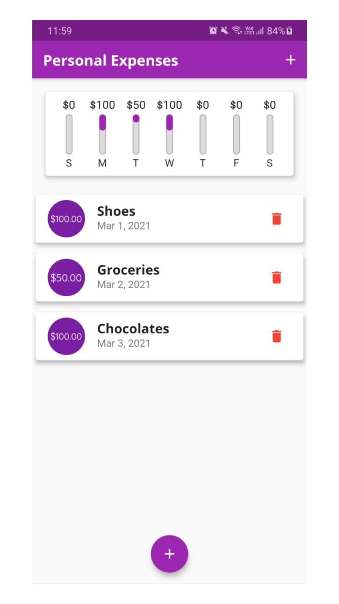
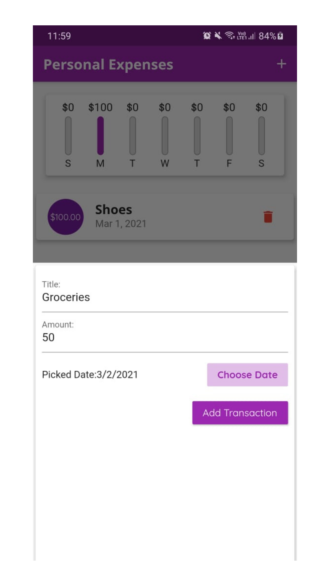
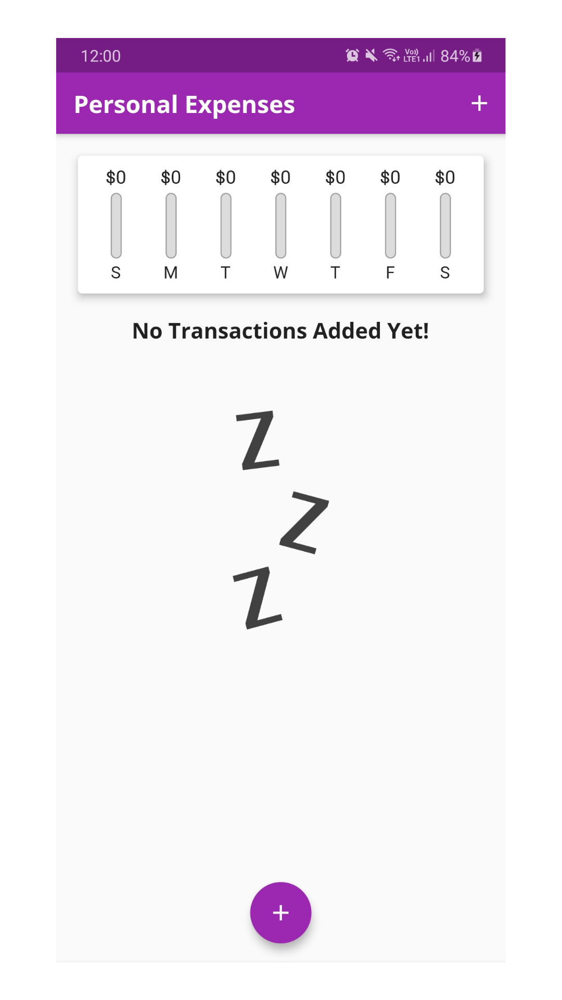

# ExpenseLog

# Hello :wave:

Welcome to **ExpenseLog**. 

## Aim

A basic app to maintain a record of your transactions with a weekly chart for easy visualization.

## Technology/ Stack used

- **Mobile framework**: Flutter v1.17.4

## Achievement :tada: :raised_hands:

This is my first flutter app!

## Screenshots & Gif

Here are some screenshots of my work -

  
  
  

### If you like my work please give me a :star:, it will motivate me to do more awesome work :blush:

